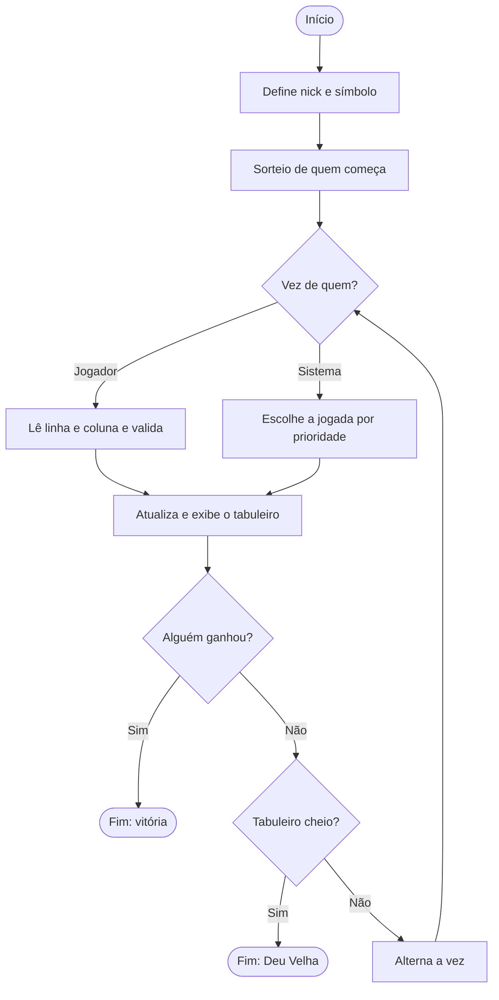

# Jogo da Velha em C


Jogo da velha (3x3) em modo texto, no qual o jogador enfrenta o computador diretamente no terminal. Projeto feito em C puro, sem bibliotecas externas, com foco em organização do código, validação de entradas e uma lógica simples de decisão para o adversário.

## Sumário

- [Funcionalidades](#funcionalidades)
- [Demonstração](#demonstração)
- [Como executar](#como-executar)
- [Como jogar](#como-jogar)
- [Como o sistema joga](#como-o-sistema-joga)
- [Estrutura do código](#estrutura-do-código)
- [Conceitos praticados](#conceitos-praticados)
- [Limitações e próximos passos](#limitações-e-próximos-passos)
- [Autor](#autor)
- [Licença](#licença)

## Funcionalidades

- Partida contra o sistema (computador) no terminal.
- Nick personalizado de 1 a 5 caracteres.
- Escolha do símbolo (X ou O); o sistema fica com o símbolo restante.
- Sorteio aleatório de quem faz a primeira jogada.
- Validação completa das entradas: posição fora do tabuleiro, casa já ocupada e entradas que não são números.
- Adversário que vence quando pode, bloqueia quando necessário e prioriza as melhores casas.
- Detecção de vitória (linha, coluna ou diagonal) e de empate ("Deu Velha!").

## Demonstração

```text
Digite seu nick (no máximo 5 letras):
Ana
Olá seja bem vindo ao jogo da velha Ana

Jogador escolha o simbolo que ira jogar X / O
x
O jogador: Ana
Escolheu: X
O sistema ficou com: O

  1  2  3
1[ ][ ][ ]
2[ ][ ][ ]
3[ ][ ][ ]
O sistema começa

  1  2  3
1[ ][ ][ ]
2[ ][O][ ]
3[ ][ ][ ]
Digite linha da onde você quer marcar
1

Digite a coluna da onde você quer marcar
1

Marcação feita com sucesso

  1  2  3
1[X][ ][ ]
2[ ][O][ ]
3[ ][ ][ ]
```

## Como executar

### Pré-requisitos

- Um compilador C, como o [GCC](https://gcc.gnu.org/) (ou o MinGW, no Windows).
- Um terminal.

### Passo a passo

1. Clone o repositório:

   ```bash
   git clone https://github.com/SEU-USUARIO/jogo-da-velha-c.git
   cd jogo-da-velha-c
   ```

2. Compile:

   ```bash
   gcc -Wall -Wextra -o main main.c
   ```

3. Execute:

   ```bash
   # Linux e macOS
   ./main

   # Windows
   main.exe
   ```

> **Acentos no Windows:** se os acentos aparecerem quebrados no terminal, rode `chcp 65001` antes de executar o jogo para ativar o UTF-8.

## Como jogar

1. Digite um nick de 1 a 5 caracteres.
2. Escolha seu símbolo: `X` ou `O`.
3. O programa informa quem começa (sorteio).
4. Na sua vez, informe o número da **linha** e depois o da **coluna** (de 1 a 3) da casa que deseja marcar.

```text
  1  2  3      <- números das colunas
1[ ][ ][ ]
2[ ][ ][ ]
3[ ][ ][ ]
^
números das linhas
```

Se a posição for inválida, já estiver ocupada ou se você digitar algo que não é número, o jogo avisa e pede a entrada novamente, sem travar.

A partida termina quando alguém completa uma linha, coluna ou diagonal, ou quando o tabuleiro fica cheio sem vencedor.

## Como o sistema joga

Na vez do sistema, ele segue uma ordem de prioridade:

1. **Vencer:** se existe uma jogada que completa uma sequência dele, ele a faz.
2. **Bloquear:** se o jogador está a uma jogada de vencer, ele ocupa essa casa.
3. **Posição estratégica:** caso contrário, ocupa a primeira casa livre na ordem: centro, cantos e, por último, laterais.

Para os itens 1 e 2, o programa **simula** a jogada em cada casa vazia, verifica se ela resulta em vitória e desfaz a simulação em seguida.



## Estrutura do código

Todo o projeto está em um único arquivo, `main.c`.

| Função | Responsabilidade |
|---|---|
| `main` | Controla o fluxo da partida: configuração inicial, alternância de turnos e fim de jogo. |
| `definirNome` | Lê e valida o nick do jogador (1 a 5 caracteres). |
| `choice` | Valida a escolha do símbolo e define automaticamente o do sistema. |
| `renderChoice` | Exibe o nick e os símbolos escolhidos. |
| `sorteio` | Sorteia quem começa (1 = jogador, 2 = sistema). |
| `exibirTabuleiro` | Desenha o tabuleiro com a numeração de linhas e colunas. |
| `marcarTabuleiro` | Lê a jogada do jogador, valida e registra no tabuleiro. |
| `jogadaSistema` | Decide e executa a jogada do sistema. |
| `buscarJogadaVencedora` | Simula jogadas para encontrar uma que vença para o símbolo informado. |
| `ganhou` | Verifica se um símbolo completou linha, coluna ou diagonal. |
| `tabuleiroCheio` | Verifica se ainda existem casas livres. |
| `posicaoValida` | Verifica se as coordenadas existem no tabuleiro 3x3. |
| `limparBuffer` | Descarta o que sobrou no buffer de entrada após uma leitura. |

## Conceitos praticados

- **Matrizes** para representar o tabuleiro e percorrê-lo com laços aninhados.
- **Ponteiros e passagem por referência**, para que `buscarJogadaVencedora` devolva as coordenadas encontradas e `choice` defina os dois símbolos.
- **Validação de entrada** com `scanf` e `fgets`, incluindo o tratamento do buffer de entrada com `limparBuffer`. Sem ele, uma letra digitada no lugar de um número deixaria o programa preso em loop infinito.
- **Simulação e desfazer**: testar uma jogada, avaliar o resultado e restaurar o estado anterior.
- **Funções pequenas e com responsabilidade única**, o que facilita a leitura e a manutenção.
- **Números aleatórios** com `rand` e `srand(time(NULL))`.

## Limitações e próximos passos

O sistema usa uma heurística simples (vencer, bloquear e escolher por prioridade). Ele **não planeja jogadas futuras**, então é possível vencê-lo em algumas situações, como quando o jogador cria duas ameaças ao mesmo tempo.

Ideias para evoluir o projeto:

- [ ] Implementar o algoritmo **Minimax** para um adversário que nunca perde.
- [ ] Adicionar a opção de **jogar novamente** ao final da partida.
- [ ] Criar o modo **jogador contra jogador**.
- [ ] Incluir níveis de dificuldade (fácil, médio e difícil).
- [ ] Manter um placar entre partidas.
- [ ] Separar o código em arquivos (`.h` e `.c`) e adicionar um `Makefile`.

## Autor

Desenvolvido por **Richard Henrique Vulgo** (livedriven).

## Licença

Distribuído sob a licença MIT. Veja o arquivo `LICENSE` para mais detalhes.
